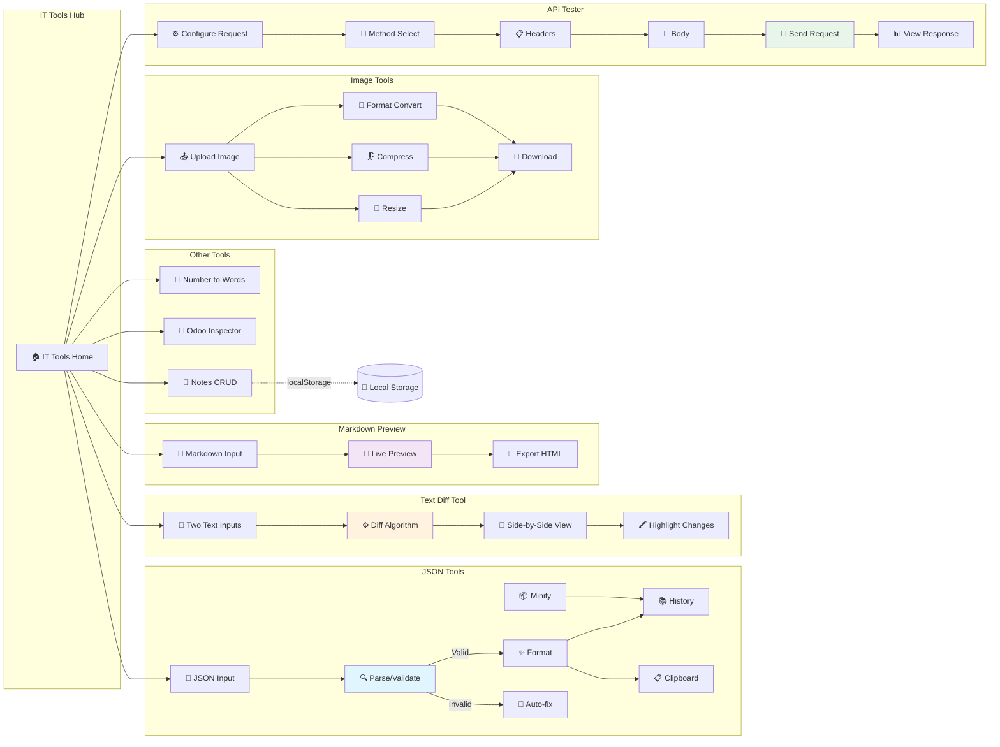
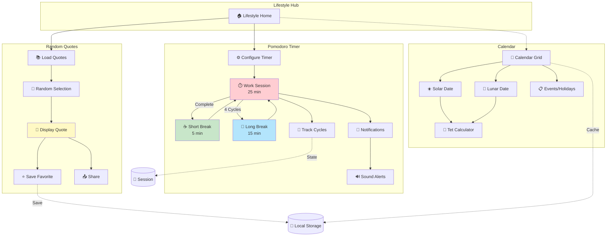
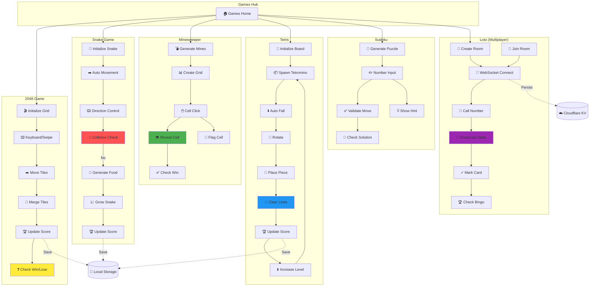
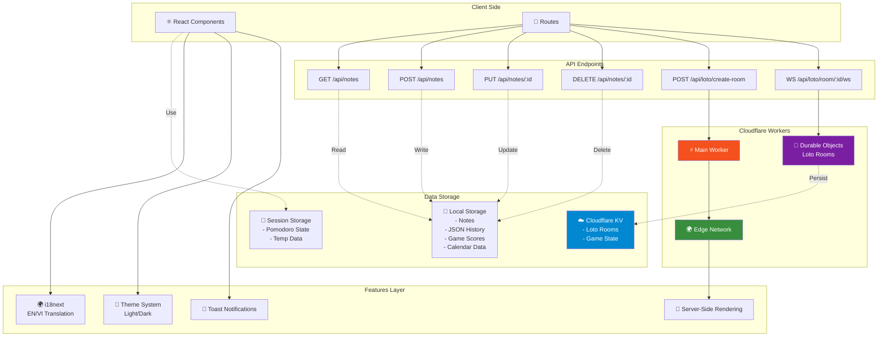

# ToolHub

Your Hub for Essential Tools
Trung tâm công cụ thiết yếu của bạn

A collection of useful online tools built with React Router.

## 🏗️ Architecture Overview

```mermaid
graph TB
    subgraph "Client Layer"
        Browser[🌐 Browser]
        Root[📄 Root Layout]
        Navbar[🧭 Navbar]
        Footer[🦶 Footer]
    end

    subgraph "Routing Layer"
        Router[🚦 React Router v7]
        Home[🏠 Home Page]

        subgraph "IT Tools Section"
            IT[💻 IT Tools Hub]
            JSON[📋 JSON Tools]
            TextDiff[🔄 Text Diff]
            Markdown[📝 Markdown Preview]
            ImageTools[🖼️ Image Tools]
            APITester[🔌 API Tester]
            NumberReading[🔢 Number Reading]
            Odoo[🎯 Odoo Inspector]
            Notes[📝 Notes]
        end

        subgraph "Lifestyle Section"
            Lifestyle[🌸 Lifestyle Hub]
            Pomodoro[⏱️ Pomodoro Timer]
            Quotes[💭 Random Quotes]
        end

        subgraph "Games Section"
            Games[🎮 Games Hub]
            Game2048[2️⃣0️⃣4️⃣8️⃣ 2048]
            Snake[🐍 Snake]
            Minesweeper[💣 Minesweeper]
            Tetris[🧱 Tetris]
            Sudoku[🔢 Sudoku]
            Loto[🎲 Loto]
        end

        Calendar[📅 Calendar]
        About[ℹ️ About]
    end

    subgraph "API Layer"
        NotesAPI[📝 Notes API]
        LotoAPI[🎲 Loto API]
        WSLoto[🔌 WebSocket Loto]
    end

    subgraph "Data Layer"
        LocalStorage[💾 Local Storage]
        CloudflareKV[☁️ Cloudflare KV]
        SessionState[🔐 Session State]
    end

    subgraph "Infrastructure"
        CloudflareWorkers[⚡ Cloudflare Workers]
        Edge[🌍 Edge Computing]
    end

    subgraph "Features"
        I18N[🌍 i18next<br/>EN/VI]
        DarkMode[🌙 Dark Mode]
        Toast[🔔 Sonner Toasts]
        SSR[🚀 SSR Support]
    end

    Browser --> Root
    Root --> Navbar
    Root --> Router
    Root --> Footer

    Router --> Home
    Router --> IT
    Router --> Lifestyle
    Router --> Games
    Router --> Calendar
    Router --> About

    IT --> JSON
    IT --> TextDiff
    IT --> Markdown
    IT --> ImageTools
    IT --> APITester
    IT --> NumberReading
    IT --> Odoo
    IT --> Notes

    Lifestyle --> Pomodoro
    Lifestyle --> Quotes

    Games --> Game2048
    Games --> Snake
    Games --> Minesweeper
    Games --> Tetris
    Games --> Sudoku
    Games --> Loto

    Notes -.->|CRUD| NotesAPI
    NotesAPI -.->|Store| LocalStorage

    Loto -.->|Create Room| LotoAPI
    Loto -.->|Real-time| WSLoto
    WSLoto -.->|Persist| CloudflareKV

    JSON -.->|History| LocalStorage
    Pomodoro -.->|State| SessionState
    Calendar -.->|Data| LocalStorage

    CloudflareWorkers --> Edge
    Edge --> Router

    Root -.->|Uses| I18N
    Root -.->|Uses| DarkMode
    Root -.->|Uses| Toast
    CloudflareWorkers -.->|Provides| SSR

    style Browser fill:#e1f5ff
    style Root fill:#fff3e0
    style Router fill:#f3e5f5
    style CloudflareWorkers fill:#e8f5e9
    style I18N fill:#fff9c4
    style DarkMode fill:#263238,color:#fff
```



### 💻 IT Tools Section Flow



### 🌸 Lifestyle Section Flow



### 🎮 Games Section Flow



### 🔌 API & Infrastructure



## Features

- 🚀 Server-side rendering
- ⚡️ Hot Module Replacement (HMR)
- 📦 Asset bundling and optimization
- 🔄 Data loading and mutations
- 🔒 TypeScript by default
- 🎉 TailwindCSS for styling
- 📝 Text Case Converter
- 🛠️ JSON Tools (Format, Validate, Minify, Fix, History, Clipboard, File Operations, Tab Size)
- 🗓️ Solar & Lunar Calendar
- 📱 PWA Support (Offline ready & Installable)
- 🖥️ CLI-friendly (`curl huyab.click/upper -d 'đường phố'`)
- 📖 [React Router docs](https://reactrouter.com/)

## CLI Usage

The case converter works from a terminal — no install, just `curl`. Requests
from curl/wget (or any client without a browser `User-Agent`) get plain text
instead of HTML.

```sh
curl huyab.click                          # banner + case list
curl huyab.click/-h                       # full help
curl huyab.click/upper -d 'đường phố'     # ĐƯỜNG PHỐ
curl 'huyab.click/title/tỉnh ninh thuận'  # Tỉnh Ninh Thuận
cat notes.txt | curl huyab.click/lower --data-binary @-
curl 'huyab.click/capitalized?text=ăn ở ưu đãi&json'
```

`wget` works the same way:

```sh
wget -qO- huyab.click/-h
wget -qO- --post-data='tỉnh ninh thuận' huyab.click/upper
wget -qO- 'huyab.click/title/tỉnh ninh thuận'
```

One wget limitation: it cannot take the body from a pipe (`--post-file` needs
a seekable file, so `-` and `/dev/stdin` both fail). Use a temp file, or curl.

Quote the whole URL when the text contains spaces — `curl huyab.click/t xin
chao` makes curl treat `xin` and `chao` as extra URLs and fail DNS. To skip
quoting entirely, install the `tc` shell function:

```sh
eval "$(curl -s huyab.click/sh)"   # add to ~/.zshrc to keep it
tc t tinh ninh thuan              # Tinh Ninh Thuan
tc upper đường phố                 # ĐƯỜNG PHỐ
cat notes.txt | tc title           # reads stdin when given no words
tc -h                              # help
```

The function is POSIX `sh` (works under sh/bash/zsh) and uses curl when
present, otherwise wget — buffering stdin into a temp file, since wget cannot
post from a pipe. With neither installed it prints `tc: needs curl or wget`.

Cases: `upper` `lower` `sentence` `capitalized` `title` `alternating`
`inverse` — each with short aliases (`u`, `l`, `s`, `cap`, `t`, `alt`, `inv`).
Add `?json` or `Accept: application/json` for a JSON reply.

Implemented in `workers/cli.ts`, which runs ahead of the React Router handler
in `workers/app.ts` and returns `null` for anything it does not own, so the
site, the `/api` routes and the WebSocket upgrades are unaffected.

## Getting Started

### Installation

Install the dependencies:

```bash
pnpm install
```

### Development

Start the development server with HMR:

```bash
pnpm dev
```

Your application will be available at `http://localhost:5173`.

## Previewing the Production Build

Preview the production build locally:

```bash
pnpm preview
```

## Building for Production

Create a production build:

```bash
pnpm build
```

## Deployment

Deployment is done using the Wrangler CLI.

To build and deploy directly to production:

```sh
pnpm deploy
```

To deploy a preview URL:

```sh
npx wrangler versions upload
```

You can then promote a version to production after verification or roll it out progressively.

```sh
npx wrangler versions deploy
```

## Styling

This template comes with [Tailwind CSS](https://tailwindcss.com/) already configured for a simple default starting experience. You can use whatever CSS framework you prefer.

---

Built with ❤️ using React Router.
